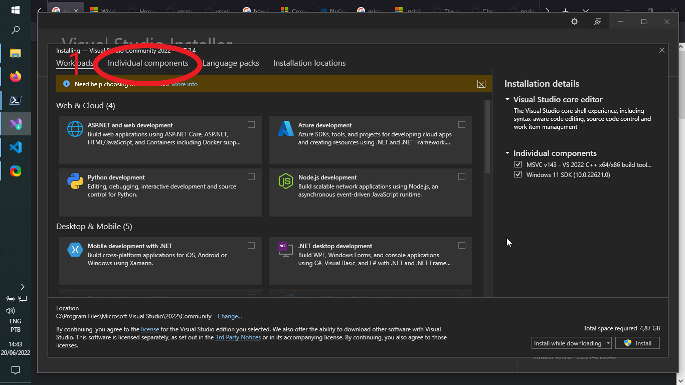
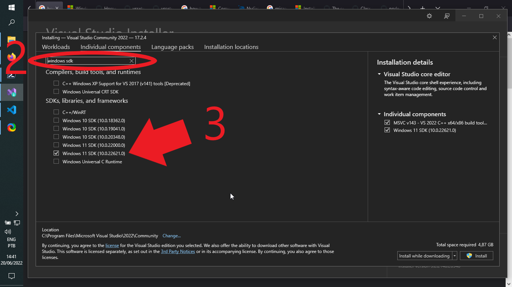
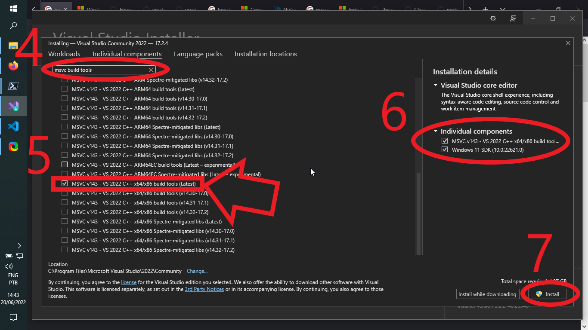

[](https://ci.appveyor.com/project/luau-project/luainstaller)

# Overview

The toolset available here aids the process to download, build and install Lua versions directly from http://www.lua.org , either manually or programmatically.

# For Endusers: TLDR;

## Setup

1. Install the most recent MSVC (Microsoft Visual Studio for C/C++) Build Tools for x86/x64 native desktop development together with the most recent Windows SDK for your operating system:
    * 
    * 
    * 
2. Download and extract the latest ```LuaInstaller.EndUsers.zip``` from the [Releases](https://github.com/luau-project/LuaInstaller/releases) page anywhere on your computer;

## Running

1. Run the ```LuaInstaller.exe```
    * If you want to install Lua on system-wide directories like ```C:\Program Files\Lua``` or ```C:\Program Files(x86)\Lua```, close the program and open ```LuaInstaller.exe``` again as administrator (Run as Administrator);
2. If everything was configured correctly, you should see each drop down with at least one choice available;
3. Hit ```Install```;
4. Verify that you can find ```lua.exe``` at ```FOLDER > bin```, where FOLDER means the destination directory for Lua installation.

# For Developers from now on

In the current stage, there are three projects:

1. **LuaInstaller.Core**

    Includes the main functionality to install Lua completely on your computer and the other projects are built around this core project as an interface to the enduser

2. **LuaInstaller.Console**

    This is a command line program meant to be used by CI servers like AppVeyor

3. **LuaInstaller**

    An application aimed to endusers, delivering a Windows Presentation Foundation (WPF) Graphical User Interface (GUI) offering the core functionality to seamlessly download, build and install on the target machine

# Future Work

We want to ease the process to have latest versions of Lua and LuaRocks installed in the system, so LuaRocks support is on top of our todo list.

The following features might come in next releases
* Logging
* LuaRocks installation
* Full rewrite of the project

# Contributors

Special thanks goes to [warlockx](https://github.com/Warlockx) for bug hunting and valuable suggestions that are going to be incorporated soon.
Also, I would like to thanks [AppVeyor](https://www.appveyor.com) for bug hunting and CI through their servers.